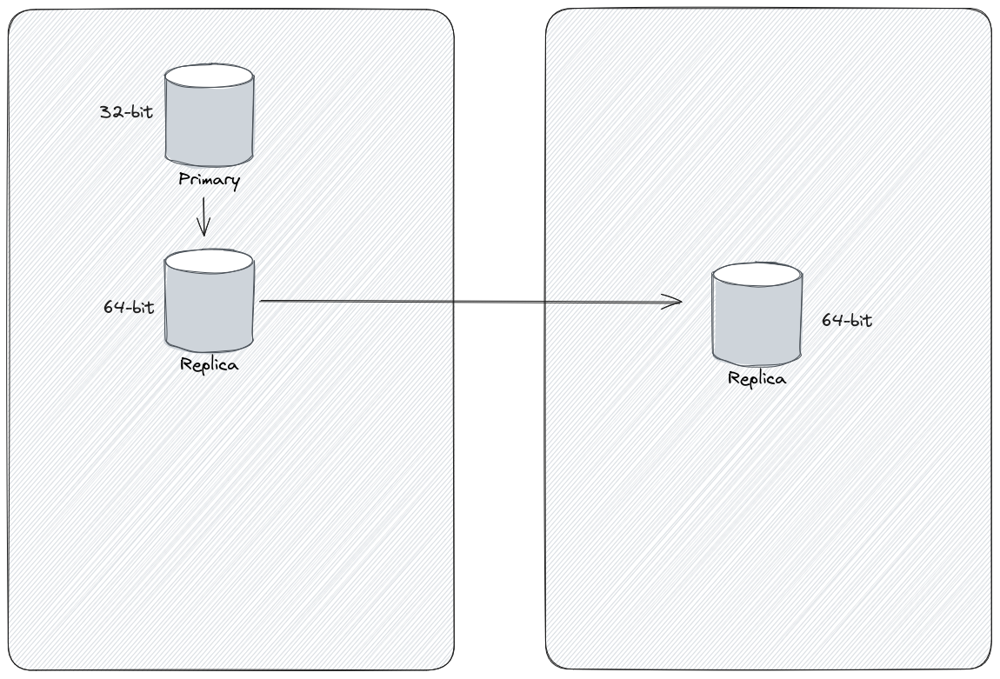

+++
title = 'Upgrading AWS RDS: What to Do When Your Primary Node Will Not Play Nice'
date = 2024-01-07T22:05:28+02:00
draft = true
tags = ['rds', 'aws']
categories = ['cloud maintenace']
series = ['naughty primary rds']
+++

> ... it's like trying to fit a square peg in a round hole ...

Hey There, Cloud Explorers!

So, you're using AWS's RDS (that's Amazon Web Services' Relational Database Service) for sometime now (since the first day of the company 😜...). As your main database, you get all sorts of services piling on top. And after blinking a few times you reach 16TB cap of the storage, can't increase it no matter what you try.... 🤷‍♂️

After a long time spent over a support case that you open - your RDS is very old - and it's still running on 32-bit FS 🤯🤯🤯 .

A rumor come's up with the inforamtion - that once upon a time an engineer managed to cut a deal with AWS support and they managed to migrate one of the replicas FS to 64-bit 🥳.

Still AWS can't find a way out of that loop the primary is in - you can migrate to 64-bit but you need to increase youe disk.

It looks like you can't even create an additional replica - you need to increase youe disk for that ....

Upgrading to 64-bit is super important for handling more data and keeping things running smoothly, it's like trying to fit a square peg in a round hole.

*That's the architecture*

Ontop of that we're talking MySQL version 5.7, EOL (End of Life) is looming just around the corner, only three months away.
AWS will auto update the database in-place taking no prisoners when they do.

We had to come up with a plan to crack this conundrum.

After brainstorming we split the update into 2 phases:
1. Get rid of the crappy 32-bit Primary
2. Blue/Green the hell out of the upgrade

Stay tuned for the next steps in this exciting journey!